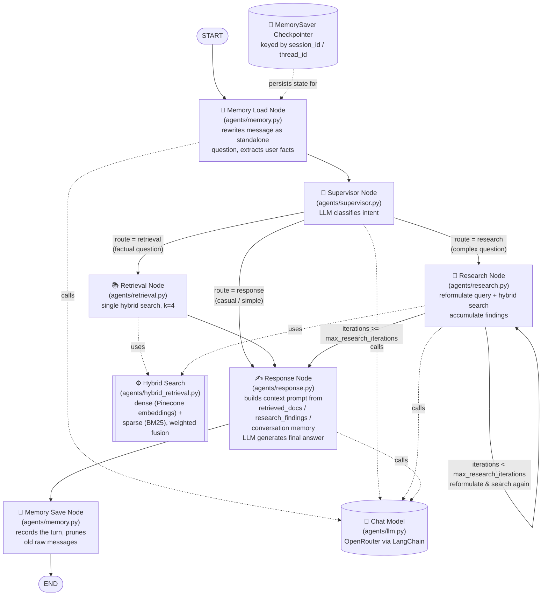

# Multi-Agent RAG Demo

A monorepo containing a frontend and backend for a multi-agent Retrieval-Augmented Generation (RAG) chat application.

## Project Structure

This project is organized as a monorepo with two main parts:

### Frontend
- **Framework**: Streamlit
- **Description**: A simple chat interface for streaming input and output
- **Features**: Real-time message streaming for user interactions

### Backend
- **Framework**: FastAPI
- **Package Manager**: uv
- **Description**: REST API that processes chat requests using LangChain and LLMs
- **Key Endpoint**:
  - `POST /chat` - Processes chat requests by passing them to an LLM via LangChain and returns the response

## Architecture

The frontend communicates with the backend's `/chat` endpoint to process user messages through an LLM, enabling a seamless chat experience with streaming capabilities.

### Agent Architecture

The backend orchestrates a LangGraph multi-agent workflow (`backend/agents/graph.py`) behind the `/chat` and `/chat/stream` endpoints:



- **Memory Load**: rewrites the latest message into a standalone question (resolving "it"/"that" against recent turns), extracts durable user facts (name, team, preferences), and selects relevant past interactions.
- **Supervisor**: an LLM call classifies the standalone question into `retrieval`, `research`, or `response`.
- **Retrieval**: runs one hybrid (dense + BM25) search against the standalone question and flows straight to `response`.
- **Research**: iteratively reformulates the standalone question and searches again, accumulating findings until `research_iterations` reaches `max_research_iterations` (default 3), then flows to `response`.
- **Response**: builds a context-aware system prompt from any retrieved docs/findings, the user's profile, previous questions, and relevant earlier exchanges, then generates the final answer via the chat model.
- **Memory Save**: appends this turn to the conversation's interaction history and prunes old raw messages beyond `MEMORY_WINDOW_TURNS`, keeping state bounded across a long-running session.
- State is checkpointed per `session_id` via LangGraph's `MemorySaver`, enabling multi-turn conversations. Conversational memory (user profile, interaction history) lives in this same checkpointed state and lasts for the life of the session (until the backend restarts or the session is deleted via `DELETE /sessions/{id}`).
- `GET /sessions/{id}/memory` returns the stored profile, previous questions, and turn count for a session.

## Getting Started

These steps will get both the backend API and the frontend chat UI running locally. Run each in its own terminal window, starting with the backend.

### Prerequisites

- Python 3.10+
- [uv](https://docs.astral.sh/uv/) package manager (recommended for the backend), or plain `pip`
- API keys for the services used by the backend (OpenRouter, Pinecone, and optionally LangSmith)

### 1. Backend (FastAPI)

```powershell
cd backend
uv venv .venv
.\.venv\Scripts\Activate.ps1
uv pip install -r requirements.txt
```

Or with plain `pip`:

```powershell
cd backend
python -m venv .venv
.\.venv\Scripts\Activate.ps1
pip install -r requirements.txt
```

Copy `.env.example` to `.env` and fill in your keys:

```powershell
copy .env.example .env
```

```
OPENROUTER_API_KEY=your_openrouter_api_key_here
PINECONE_API_KEY=your_pinecone_api_key_here
PINECONE_INDEX_NAME=multi-agent-rag-demo
PINECONE_CLOUD=aws
PINECONE_REGION=us-east-1
EMBEDDING_MODEL=openai/text-embedding-3-small
CHAT_MODEL=deepseek/deepseek-v4.1-flash
MAX_RESEARCH_ITERATIONS=3
MEMORY_WINDOW_TURNS=6
MEMORY_RELEVANT_K=3
MEMORY_MAX_INTERACTIONS=50
```

(`LANGCHAIN_TRACING_V2` and `LANGCHAIN_API_KEY` are optional and only needed if you want LangSmith tracing.)

Start the server:

```powershell
python main.py
```

Or with uvicorn directly:

```powershell
uvicorn main:app --reload --host 0.0.0.0 --port 8000
```

Or with fastapi for dev server:

```powershell
uv run fastapi dev
```

The API will be available at `http://localhost:8000`, with interactive docs at `http://localhost:8000/docs`. Confirm it's running by checking `http://localhost:8000/health`.

### 2. Frontend (Streamlit)

Open a second terminal:

```powershell
cd frontend
python -m venv .venv
.\.venv\Scripts\Activate.ps1
pip install -r requirements.txt
```

Copy `.env.example` to `.env`:

```powershell
copy .env.example .env
```

```
BACKEND_URL=http://localhost:8000
REQUEST_TIMEOUT=90
```

Start the app:

```powershell
streamlit run app.py
```

The chat UI will open at `http://localhost:8501`. Make sure the backend (step 1) is already running before sending a message, since the frontend calls the backend's `/chat` endpoint.